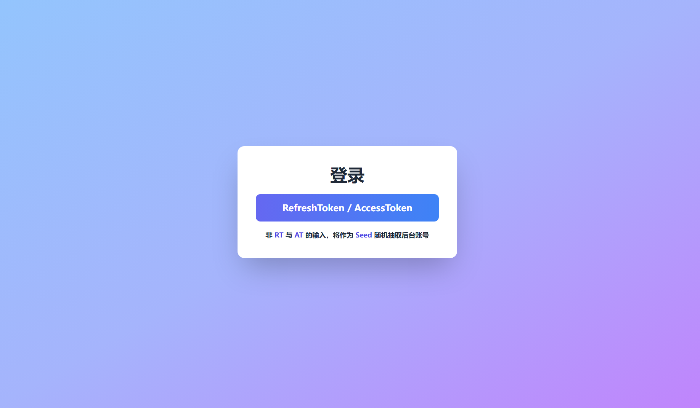
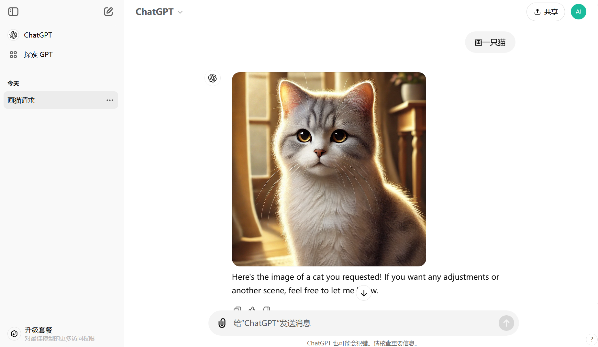

# CHAT2API

🤖 一个简单的 ChatGPT TO API 代理

🌟 无需账号即可使用免费、无限的 `GPT-3.5`

💥 支持 AccessToken 使用账号，支持 `O1-Preview/mini`、`GPT-4`、`GPT-4o/mini`、 `GPTs`

🔍 回复格式与真实 API 完全一致，适配几乎所有客户端

👮 配套用户管理端[Chat-Share](https://github.com/h88782481/Chat-Share)使用前需提前配置好环境变量（ENABLE_GATEWAY设置为True，AUTO_SEED设置为False）


## 交流群

[https://t.me/chat2api](https://t.me/chat2api)

要提问请先阅读完仓库文档，尤其是常见问题部分。

提问时请提供：

1. 启动日志截图（敏感信息打码，包括环境变量和版本号）
2. 报错的日志信息（敏感信息打码）
3. 接口返回的状态码和响应体

## 功能

### 最新版本号存于 `version.txt`

### 逆向API 功能
> - [x] 流式、非流式传输
> - [x] 免登录 GPT-3.5 对话
> - [x] GPT-3.5 模型对话（传入模型名不包含 gpt-4，则默认使用 gpt-3.5，也就是 text-davinci-002-render-sha）
> - [x] GPT-4 系列模型对话（传入模型名包含: gpt-4，gpt-4o，gpt-4o-mini，gpt-4-moblie 即可使用对应模型，需传入 AccessToken）
> - [x] O1 系列模型对话（传入模型名包含 o1-preview，o1-mini 即可使用对应模型，需传入 AccessToken）
> - [x] GPT-4 模型画图、代码、联网
> - [x] 支持 GPTs（传入模型名：gpt-4-gizmo-g-*）
> - [x] 支持 Team Plus 账号（需传入 team account id）
> - [x] 上传图片、文件（格式为 API 对应格式，支持 URL 和 base64）
> - [x] 可作为网关使用，可多机分布部署
> - [x] 多账号轮询，同时支持 `AccessToken` 和 `RefreshToken`
> - [x] 请求失败重试，自动轮询下一个 Token
> - [x] Tokens 管理，支持上传、清除
> - [x] 定时使用 `RefreshToken` 刷新 `AccessToken` / 每次启动将会全部非强制刷新一次，每4天晚上3点全部强制刷新一次。
> - [x] 支持文件下载，需要开启历史记录
> - [x] 支持 `O1-Preview/mini` 模型推理过程输出

### 官网镜像 功能
> - [x] 支持官网原生镜像
> - [x] 后台账号池随机抽取，`Seed` 设置随机账号
> - [x] 输入 `RefreshToken` 或 `AccessToken` 直接登录使用
> - [x] 支持 O1-Preview/mini、GPT-4、GPT-4o/mini
> - [x] 敏感信息接口禁用、部分设置接口禁用
> - [x] /login 登录页面，注销后自动跳转到登录页面
> - [x] /?token=xxx 直接登录, xxx 为 `RefreshToken` 或 `AccessToken` 或 `SeedToken` (随机种子)


> TODO
> - [ ] 镜像支持 `GPTs`
> - [ ] 暂无，欢迎提 `issue`

## 逆向API

完全 `OpenAI` 格式的 API ，支持传入 `AccessToken` 或 `RefreshToken`，可用 GPT-4, GPT-4o, GPTs, O1-Preview, O1-Mini：

```bash
curl --location 'http://127.0.0.1:5005/v1/chat/completions' \
--header 'Content-Type: application/json' \
--header 'Authorization: Bearer {{Token}}' \
--data '{
     "model": "gpt-3.5-turbo",
     "messages": [{"role": "user", "content": "Say this is a test!"}],
     "stream": true
   }'
```

将你账号的 `AccessToken` 或 `RefreshToken` 作为 `{{ Token }}` 传入。
也可填写你设置的环境变量 `Authorization` 的值, 将会随机选择后台账号

如果有team账号，可以传入 `ChatGPT-Account-ID`，使用 Team 工作区：

- 传入方式一：
`headers` 中传入 `ChatGPT-Account-ID`值

- 传入方式二：
`Authorization: Bearer <AccessToken 或 RefreshToken>,<ChatGPT-Account-ID>`

如果设置了 `AUTHORIZATION` 环境变量，可以将设置的值作为 `{{ Token }}` 传入进行多 Tokens 轮询。

> - `AccessToken` 获取: chatgpt官网登录后，再打开 [https://chatgpt.com/api/auth/session](https://chatgpt.com/api/auth/session) 获取 `accessToken` 这个值。
> - `RefreshToken` 获取: 此处不提供获取方法。
> - 免登录 gpt-3.5 无需传入 Token。

## Tokens 管理

1. 配置环境变量 `AUTHORIZATION` 作为 `授权码` ，然后运行程序。

2. 访问 `/tokens` 或者 `/{api_prefix}/tokens` 可以查看现有 Tokens 数量，也可以上传新的 Tokens ，或者清空 Tokens。

3. 请求时传入 `AUTHORIZATION` 中配置的 `授权码` 即可使用轮询的Tokens进行对话


## 官网原生镜像

1. 配置环境变量 `ENABLE_GATEWAY` 为 `true`，然后运行程序, 注意开启后别人也可以直接通过域名访问你的网关。

2. 在 Tokens 管理页面上传 `RefreshToken` 或 `AccessToken`

3. 访问 `/login` 到登录页面



4. 进入官网原生镜像页面使用



## 环境变量

每个环境变量都有默认值，如果不懂环境变量的含义，请不要设置，更不要传空值，字符串无需引号。

| 分类   | 变量名               | 示例值                                                         | 默认值                   | 描述                                                           |
|------|-------------------|-------------------------------------------------------------|-----------------------|--------------------------------------------------------------|
| 安全相关 | API_PREFIX        | `your_prefix`                                               | `None`                | API 前缀密码，不设置容易被人访问，设置后需请求 `/your_prefix/v1/chat/completions` |
|      | AUTHORIZATION     | `your_first_authorization`,<br/>`your_second_authorization` | `[]`                  | 你自己为使用多账号轮询 Tokens 设置的授权码，英文逗号分隔                             |
|      | AUTH_KEY          | `your_auth_key`                                             | `None`                | 私人网关需要加`auth_key`请求头才设置该项                                    |
| 请求相关 | CHATGPT_BASE_URL  | `https://chatgpt.com`                                       | `https://chatgpt.com` | ChatGPT 网关地址，设置后会改变请求的网站，多个网关用逗号分隔                           |
|      | PROXY_URL         | `http://ip:port`,<br/>`http://username:password@ip:port`    | `[]`                  | 全局代理 URL，出 403 时启用，多个代理用逗号分隔                                 |
|      | EXPORT_PROXY_URL  | `http://ip:port`或<br/>`http://username:password@ip:port`    | `None`                | 出口代理 URL，防止请求图片和文件时泄漏源站 ip                                   |
| 功能相关 | HISTORY_DISABLED  | `true`                                                      | `true`                | 是否不保存聊天记录并返回 conversation_id                                 |
|      | POW_DIFFICULTY    | `00003a`                                                    | `00003a`              | 要解决的工作量证明难度，不懂别设置                                            |
|      | RETRY_TIMES       | `3`                                                         | `3`                   | 出错重试次数，使用 `AUTHORIZATION` 会自动随机/轮询下一个账号                      |
|      | CONVERSATION_ONLY | `false`                                                     | `false`               | 是否直接使用对话接口，如果你用的网关支持自动解决 `POW` 才启用                           |
|      | ENABLE_LIMIT      | `true`                                                      | `true`                | 开启后不尝试突破官方次数限制，尽可能防止封号                                       |
|      | UPLOAD_BY_URL     | `false`                                                     | `false`               | 开启后按照 `URL+空格+正文` 进行对话，自动解析 URL 内容并上传，多个 URL 用空格分隔           |
|      | SCHEDULED_REFRESH | `false`                                                     | `false`               | 是否定时刷新 `AccessToken` ，开启后每次启动程序将会全部非强制刷新一次，每4天晚上3点全部强制刷新一次。  |
|      | RANDOM_TOKEN      | `true`                                                      | `true`                | 是否随机选取后台 `Token` ，开启后随机后台账号，关闭后为顺序轮询                         |
| 网关功能 | ENABLE_GATEWAY    | `false`                                                     | `false`               | 是否启用网关模式，开启后可以使用镜像站，但也将会不设防                                  |
|      | AUTO_SEED          | `false`                                                     | `true`               | 是否启用随机账号模式，默认启用，输入`seed`后随机匹配后台`Token`。关闭之后需要手动对接接口，来进行`Token`管控。    |

## 部署

### Zeabur 部署

[](https://zeabur.com/templates/6HEGIZ?referralCode=LanQian528)

### 直接部署

```bash
git clone https://github.com/LanQian528/chat2api
cd chat2api
pip install -r requirements.txt
python app.py
```

### Docker 部署

您需要安装 Docker 和 Docker Compose。

```bash
docker run -d \
  --name chat2api \
  -p 5005:5005 \
  lanqian528/chat2api:latest
```

### (推荐，可用 PLUS 账号) Docker Compose 部署

创建一个新的目录，例如 chat2api，并进入该目录：

```bash
mkdir chat2api
cd chat2api
```

在此目录中下载库中的 docker-compose.yml 文件：

```bash
wget https://raw.githubusercontent.com/LanQian528/chat2api/main/docker-compose-warp.yml
```

修改 docker-compose-warp.yml 文件中的环境变量，保存后：

```bash
docker-compose up -d
```


## 常见问题

> - 错误代码：
>   - `401`：当前 IP 不支持免登录，请尝试更换 IP 地址，或者在环境变量 `PROXY_URL` 中设置代理，或者你的身份验证失败。
>   - `403`：请在日志中查看具体报错信息。
>   - `429`：当前 IP 请求1小时内请求超过限制，请稍后再试，或更换 IP。
>   - `500`：服务器内部错误，请求失败。
>   - `502`：服务器网关错误，或网络不可用，请尝试更换网络环境。

> - 已知情况：
>   - 日本 IP 很多不支持免登，免登 GPT-3.5 建议使用美国 IP。
>   - 99%的账号都支持免费 `GPT-4o` ，但根据 IP 地区开启，目前日本和新加坡 IP 已知开启概率较大。

> - 环境变量 `AUTHORIZATION` 是什么？
>   - 是一个自己给 chat2api 设置的一个身份验证，设置后才可使用已保存的 Tokens 轮询，请求时当作 `APIKEY` 传入。
> - AccessToken 如何获取？
>   - chatgpt官网登录后，再打开 [https://chatgpt.com/api/auth/session](https://chatgpt.com/api/auth/session) 获取 `accessToken` 这个值。


## License

MIT License

